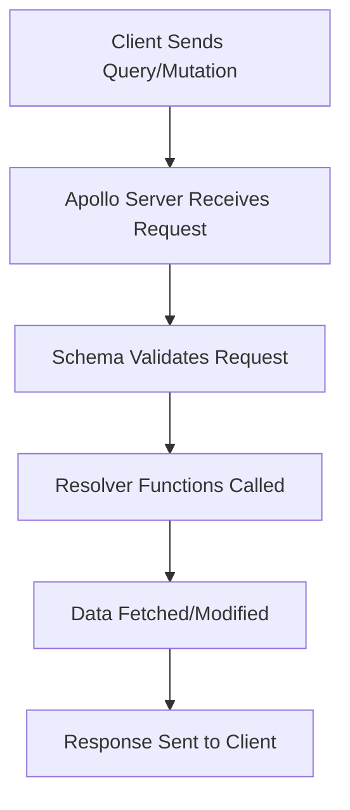

# GraphQL Example Project – Beginner’s Guide

---

## Table of Contents

1. [What is GraphQL?](#what-is-graphql)
2. [Core Concepts](#core-concepts)
3. [Project Structure](#project-structure)
4. [Schema Definition (`typeDefs.js`)](#schema-definition-typedefsjs)
5. [Resolvers (`resolvers.js`)](#resolvers-resolversjs)
6. [Apollo Server (`index.js`)](#apollo-server-indexjs)
7. [How Queries & Mutations Work](#how-queries--mutations-work)
8. [GraphQL Type System Explained](#graphql-type-system-explained)
9. [Flow Diagram](#flow-diagram)
10. [Tips for Learning GraphQL](#tips-for-learning-graphql)
11. [Further Reading](#further-reading)

---

## What is GraphQL?

GraphQL is a query language for APIs and a runtime for executing those queries. It lets you ask for exactly the data you need, making APIs more flexible and efficient than traditional REST APIs.

---

## Core Concepts

- **Schema:** Blueprint of your data and operations.
- **Types:** Define the shape of your data (e.g., `Book`, `Author`).
- **Query:** Read data.
- **Mutation:** Change data.
- **Resolvers:** Functions that fetch or modify data.
- **Apollo Server:** Runs your GraphQL API.

---

## Project Structure

```
GraphQL/
│
├── index.js        # Starts Apollo Server
├── typeDefs.js     # GraphQL schema definition
└── resolvers.js    # Resolver functions for schema fields
```

---

## Schema Definition (`typeDefs.js`)

The schema describes what data you can query or mutate.

```graphql
type Author {
  id: ID!
  name: String!
  books: [Book]
}

type Book {
  id: ID!
  title: String!
  publishedYear: Int
  author: Author
}

type Query {
  authors: [Author]
  books: [Book]
}

type Mutation {
  addBook(title: String!, publishedYear: Int, authorId: ID!): Book!
}
```

### Key Symbols

- `!` (Exclamation Mark): Field is **required** (non-nullable).
- `[]` (Square Brackets): Field is a **list** (array).
- `ID`: Unique identifier (often a string).
- `String`, `Int`: Scalar types (text, integer).

---

## Resolvers (`resolvers.js`)

Resolvers are functions that fetch the actual data for each field in your schema.

- **Query Resolvers:** Return all authors or books.
- **Field Resolvers:** For nested fields like `Author.books` or `Book.author`.
- **Mutation Resolver:** Adds a new book.

Example:
```javascript
Query: {
  authors: () => data.authors,
  books: () => data.books,
},
Author: {
  books: (parent) => data.books.filter(book => parent.bookIds.includes(book.id)),
},
Book: {
  author: (parent) => data.authors.find(author => author.id === parent.authorId),
},
Mutation: {
  addBook: (parent, args) => { /* ... */ }
}
```

---

## Apollo Server (`index.js`)

Apollo Server runs your GraphQL API.

```javascript
const server = new ApolloServer({ typeDefs, resolvers });
await startStandaloneServer(server, { listen: { port: 4001 } });
```

---

## How Queries & Mutations Work

### Query Example

```graphql
{
  authors {
    name
    books {
      title
    }
  }
}
```
- Returns all authors and the titles of their books.

### Mutation Example

```graphql
mutation {
  addBook(title: "New Book", publishedYear: 2025, authorId: "1") {
    id
    title
  }
}
```
- Adds a new book and returns its id and title.

---

## GraphQL Type System Explained

| Type      | Description                                 | Example                |
|-----------|---------------------------------------------|------------------------|
| `ID`      | Unique identifier (string)                  | `id: ID!`              |
| `String`  | Text                                        | `name: String!`        |
| `Int`     | Integer number                              | `publishedYear: Int`   |
| `[Type]`  | List of items of that type                  | `books: [Book]`        |
| `Type!`   | Non-nullable (must always have a value)     | `title: String!`       |

---

## Flow Diagram

Below is a simple flow diagram showing how a GraphQL request is processed:



---

## Tips for Learning GraphQL

- **Start with the schema:** Understand what data is available.
- **Practice writing queries:** Ask for different fields and nested data.
- **Experiment with mutations:** Try adding or changing data.
- **Understand resolvers:** See how data is fetched for each field.
- **Use tools like Apollo Studio or GraphQL Playground** to test queries.

---

## Further Reading

- [Official GraphQL Documentation](https://graphql.org/learn/)
- [Apollo Server Docs](https://www.apollographql.com/docs/apollo-server/)
- [How to GraphQL](https://www.howtographql.com/)

---

**Happy Learning!**  
This project is a great starting point. Play with the code, change the schema, and write your own queries and mutations to become a GraphQL expert!


---

## Advanced GraphQL Concepts & Interview Topics

### 1. **Fragments**
Fragments let you reuse parts of queries to avoid repetition.

```graphql
fragment BookDetails on Book {
  id
  title
  publishedYear
}

query {
  books {
    ...BookDetails
    author {
      name
    }
  }
}
```

---

### 2. **Variables in Queries**
Variables make queries dynamic and reusable.

```graphql
query GetBooksByYear($year: Int) {
  books(publishedYear: $year) {
    title
  }
}
```

---

### 3. **Directives**
Directives like `@include` and `@skip` control query execution.

```graphql
query($showYear: Boolean!) {
  books {
    title
    publishedYear @include(if: $showYear)
  }
}
```

---

### 4. **Error Handling**
Resolvers can throw errors. Apollo formats these for the client.

```javascript
if (!author) {
  throw new Error("Author not found");
}
```

---

### 5. **Pagination**
For large datasets, use pagination patterns like `limit`/`offset` or `cursor`-based.

```graphql
query {
  books(limit: 10, offset: 20) {
    title
  }
}
```

---

### 6. **Authentication & Authorization**
Protect sensitive data by checking user permissions in resolvers.

```javascript
if (!context.user) {
  throw new AuthenticationError("You must be logged in");
}
```

---

### 7. **Batching & Caching**
Tools like [DataLoader](https://github.com/graphql/dataloader) help batch and cache database requests for efficiency.

---

### 8. **Subscriptions**
GraphQL supports real-time updates using subscriptions (WebSockets).

```graphql
type Subscription {
  bookAdded: Book
}
```

---

### 9. **N+1 Problem**
When resolving nested fields, be aware of the N+1 query problem. Use batching/caching to avoid performance issues.

---

### 10. **Schema Stitching & Federation**
For microservices, you can combine multiple schemas (schema stitching) or use Apollo Federation for distributed GraphQL.

---

## Common Interview Questions

- What are the advantages of GraphQL over REST?
- How does GraphQL handle over-fetching and under-fetching?
- Explain the difference between Query, Mutation, and Subscription.
- What is the N+1 problem and how do you solve it?
- How do you secure a GraphQL API?
- What are fragments and why are they useful?
- How do you handle errors in GraphQL?
- What is schema stitching/federation?
- How does GraphQL handle versioning?
- How do you implement pagination in GraphQL?

---

## Practice & Explore

- Try adding authentication to your resolvers.
- Implement pagination for your books query.
- Experiment with fragments and variables in your queries.
- Explore Apollo Federation for microservices.

---

**Keep Practicing!**  
Deep understanding comes from building, experimenting, and reading real-world code. Good luck with your learning and interviews!

